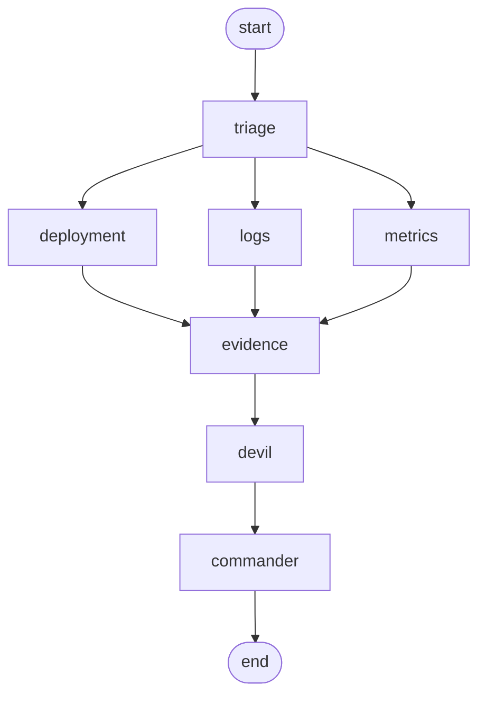

# AgentOps Incident Commander

An AI-powered incident response system built with LangGraph that simulates a multi-agent incident management workflow for analyzing and resolving production incidents.

---

## 📋 Overview

The **AgentOps Incident Commander** is a demonstration of how multiple specialized AI agents can collaborate to investigate, analyze, and report on system incidents. The system simulates an SRE (Site Reliability Engineering) team where each agent has a specific role in the incident response process.

---

## 🎯 Key Features

- **Multi-Agent Architecture**: Six specialized agents working in coordination
- **LangGraph Workflow**: Directed graph execution with state management
- **Real-time Incident Analysis**: Log analysis, metrics analysis, and deployment investigation
- **Devil's Advocate Review**: Built-in challenge mechanism to test hypotheses
- **Comprehensive Reporting**: Structured incident commander report generation
- **NVIDIA AI Integration**: Powered by NVIDIA NIM endpoints for LLM capabilities

---

## 🏗️ System Architecture

### Agent Roles

| Agent | Role | Responsibility |
|-------|------|----------------|
| **Triage Agent** | Initial Assessment | Classifies severity, identifies affected systems, creates initial hypotheses |
| **Log Analysis Agent** | Log Examination | Parses logs for errors, warnings, patterns, and suspicious events |
| **Metrics Analysis Agent** | Performance Analysis | Analyzes metrics anomalies and estimates root causes |
| **Deployment Analysis Agent** | Deployment Investigation | Evaluates if recent deployments caused the incident |
| **Evidence Aggregator** | Consolidation | Combines all analyses into factual evidence bullet points |
| **Devil's Advocate** | Challenge | Identifies alternative explanations, missing evidence, weak assumptions |
| **Incident Commander** | Final Report | Produces professional report with root cause and recommendations |

### Workflow Diagram

### 🧪 Sample Incident Output

### Executive Summary
At 14:30 UTC on 2026-07-15 the checkout-service began experiencing a 
dramatic latency increase (≈8s vs. baseline ≈210ms) and a surge in 
error rates (≈14.6% vs. baseline ≈0.2%). The symptoms coincided with 
the v2.4 deployment that touched the Order Entity, Checkout Mapper, 
added Customer serialization, and introduced an Order History endpoint.

### Most Likely Root Cause
Inefficient data-access pattern introduced in v2.4 – likely an N+1 
query scenario or missing index triggered by the newly added Order 
History endpoint.

*Confidence:* 80%

### Immediate Actions
1. Roll back v2.4 deployment
2. Identify the offending query using slow-query logs
3. Add missing indexes
4. Scale DB resources temporarily

    EVIDENCE --> DEVIL[Devil's Advocate]
    DEVIL --> COMMANDER[Incident Commander]
    COMMANDER --> END([END])
